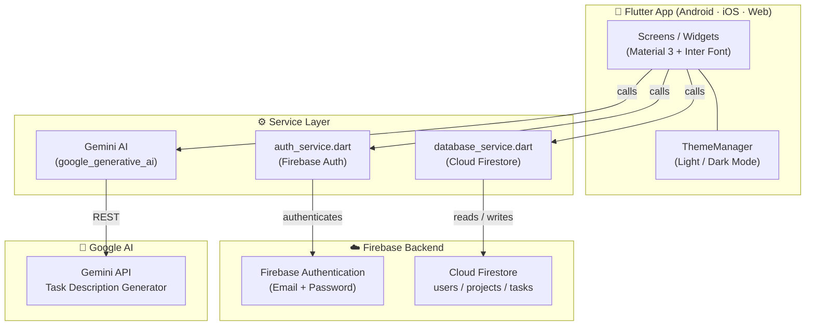
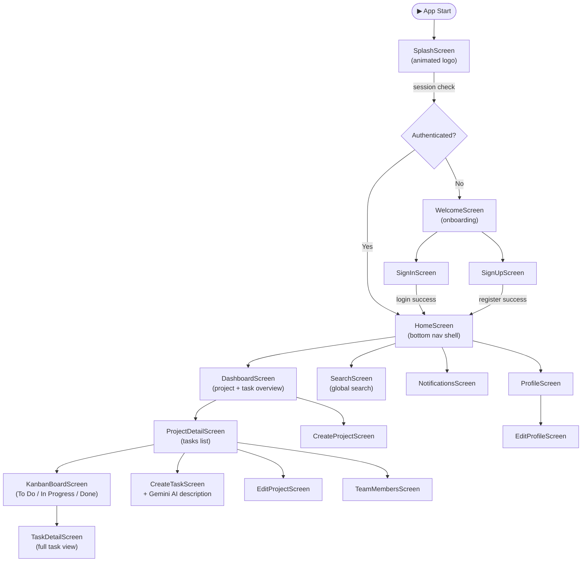
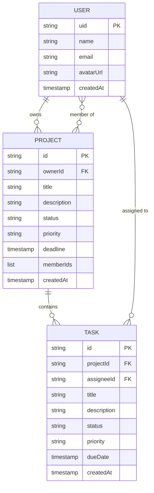
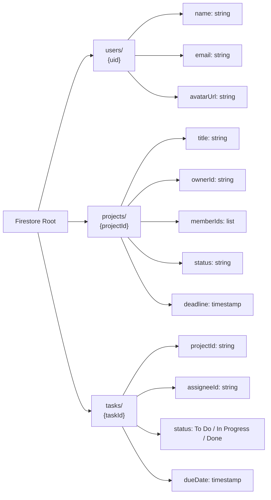
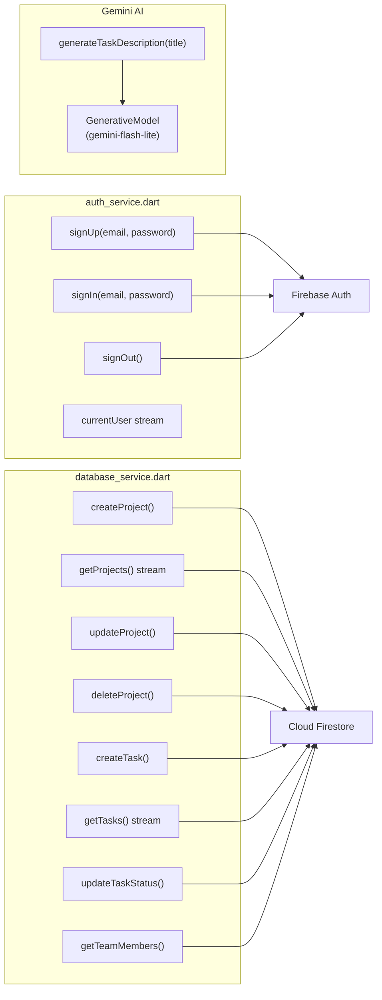
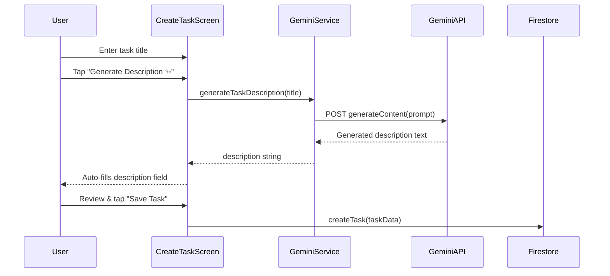

# ProjeManage

<div align="center">

> **AI-Powered Project Management** — Plan, track, and deliver projects with your team, powered by Google Gemini AI and Firebase.

[](https://flutter.dev)
[](https://dart.dev)
[](https://firebase.google.com)
[](https://ai.google.dev)
[](https://flutter.dev/multi-platform)

</div>

---

## What is ProjeManage?

**ProjeManage** is a full-featured, cross-platform project management application built with Flutter. It lets individuals and teams create projects, manage tasks with a visual Kanban board, collaborate with team members, and receive AI-generated task descriptions powered by **Google Gemini AI**.

### Key Highlights

| Feature | Description |
|---|---|
| 🔐 **Firebase Auth** | Email/password sign-up, sign-in, and persistent sessions |
| 📁 **Project Management** | Create, edit, and track multiple projects with deadlines and priorities |
| ✅ **Task Kanban Board** | Drag-and-drop tasks across `To Do → In Progress → Done` columns |
| 🤖 **Gemini AI** | Auto-generate professional task descriptions from a title |
| 👥 **Team Members** | Add team members to projects and assign tasks |
| 🔔 **Notifications** | In-app notification center for updates and activity |
| 🔍 **Global Search** | Search across projects and tasks instantly |
| 🌙 **Dark / Light Mode** | Smooth theme switching, persisted across sessions |
| 📊 **Dashboard** | At-a-glance overview of all project and task statuses |

---

## Architecture Overview

### High-Level System Architecture



---

### Navigation & Screen Flow



---

### Data Model



---

### Firestore Data Structure



---

### Service Layer Architecture



---

### AI Task Description Flow



---

## Project Structure

```
ProjeManage/
├── lib/
│   ├── main.dart                  Entry point, Firebase init, routing
│   ├── firebase_options.dart       Generated Firebase config
│   │
│   ├── models/
│   │   ├── user_model.dart         User data class
│   │   ├── project_model.dart      Project data class
│   │   └── task_model.dart         Task data class
│   │
│   ├── services/
│   │   ├── auth_service.dart       Firebase Auth wrapper
│   │   └── database_service.dart   Firestore CRUD operations
│   │
│   ├── screens/
│   │   ├── splash_screen.dart      Animated launch screen
│   │   ├── welcome_screen.dart     Onboarding / landing
│   │   ├── sign_in_screen.dart     Login form
│   │   ├── sign_up_screen.dart     Registration form
│   │   ├── home_screen.dart        Shell with bottom navigation
│   │   ├── dashboard_screen.dart   Project and task overview
│   │   ├── create_project_screen.dart
│   │   ├── edit_project_screen.dart
│   │   ├── project_detail_screen.dart
│   │   ├── kanban_board_screen.dart   To Do / In Progress / Done
│   │   ├── create_task_screen.dart    + Gemini AI description
│   │   ├── task_detail_screen.dart
│   │   ├── team_members_screen.dart
│   │   ├── notifications_screen.dart
│   │   ├── search_screen.dart
│   │   ├── profile_screen.dart
│   │   ├── edit_profile_screen.dart
│   │   └── water_bill_screen.dart
│   │
│   └── theme/
│       └── theme_manager.dart      Light / dark theme tokens
│
├── assets/
│   └── icon.png                    App icon
│
├── android/                        Android platform project
├── ios/                            iOS platform project
├── web/                            Web platform project
├── windows/                        Windows platform project
├── linux/                          Linux platform project
├── macos/                          macOS platform project
│
├── firebase.json                   Firebase Hosting + Firestore config
├── firestore.rules                 Firestore security rules
├── firestore.indexes.json          Composite index definitions
└── pubspec.yaml                    Flutter dependencies
```

---

## Prerequisites

| Tool | Version |
|---|---|
| Flutter | 3.x (Dart SDK ^3.7.2) |
| Dart | 3.7+ |
| Firebase CLI | latest (`npm install -g firebase-tools`) |
| FlutterFire CLI | latest (`dart pub global activate flutterfire_cli`) |
| Android Studio / Xcode | for Android / iOS targets |

---

## Getting Started

### 1 — Clone the repository

```bash
git clone https://github.com/Aditi05336/ProjeManage.git
cd ProjeManage
```

### 2 — Install Flutter dependencies

```bash
flutter pub get
```

### 3 — Set up Firebase

**a. Create a Firebase project** at [console.firebase.google.com](https://console.firebase.google.com)

**b. Enable services** in the Firebase console:
- Authentication → Email/Password provider
- Cloud Firestore → Create database (Start in test mode for dev)

**c. Connect your Flutter app:**

```bash
# Log in and configure
firebase login
flutterfire configure
```

This generates `lib/firebase_options.dart` automatically.

### 4 — Set up Gemini AI

Get a free API key from [Google AI Studio](https://aistudio.google.com/app/apikey):

Then paste that api api key in lib/screens/create_task.dart
```
REPLACE
'<ENTER YOUR GEMINI KEY HERE>'
         WITH
    'AfcgfT.....iL'
```

```dart
// lib/screens/create_task_screen.dart
final model = GenerativeModel(
  model: 'gemini-2.5-flash-lite',
  apiKey: 'YOUR_GEMINI_API_KEY',
);
```

> **Tip:** For production, load the key from environment variables using `--dart-define` or a secrets management package.

### 5 — Run the app

```bash
# Android / iOS
flutter run

# Web
flutter run -d chrome

# Windows
flutter run -d windows
```

---

## Features in Depth

### Kanban Board

The `KanbanBoardScreen` displays tasks for a project in three columns:

| Column | Meaning |
|---|---|
| **To Do** | Task created, not started |
| **In Progress** | Actively being worked on |
| **Done** | Completed |

Tasks can be moved between columns by updating their `status` field in Firestore, which triggers a real-time stream update to all connected clients.

### AI Task Description Generator

When creating a task, users can tap **"Generate Description ✨"** — ProjeManage sends the task title to the Gemini API and receives a professional, context-aware description in seconds.

**Example:**
- Input title: `"Set up CI/CD pipeline"`
- Generated: `"Configure an automated continuous integration and continuous delivery pipeline using GitHub Actions to build, test, and deploy the application on every push to the main branch..."`

### Theme System

`ThemeManager` provides a `ValueNotifier<ThemeMode>` that the root `MaterialApp` listens to. Both light and dark themes use the **Inter** typeface (via `google_fonts`) and Cupertino-style page transitions for a premium, native feel on both Android and iOS.

---

## Tech Stack

| Layer | Technology |
|---|---|
| UI Framework | Flutter 3.x + Material 3 |
| Language | Dart 3.7+ |
| Authentication | Firebase Authentication (Email/Password) |
| Database | Cloud Firestore (real-time streams) |
| AI | Google Generative AI (`gemini-2.5-flash-lite`) |
| Fonts | Google Fonts — Inter |
| Animations | `animate_do` package |
| App Icons | `flutter_launcher_icons` |
| Platforms | Android, iOS, Web, Windows, Linux, macOS |

---

## Firebase Security Rules

The current rules allow open read/write for development purposes. **Before deploying to production**, restrict access by authenticated users:

```js
rules_version = '2';
service cloud.firestore {
  match /databases/{database}/documents {
    // ✅ Authenticated users only
    match /users/{userId} {
      allow read, write: if request.auth != null && request.auth.uid == userId;
    }
    match /projects/{projectId} {
      allow read, write: if request.auth != null;
    }
    match /tasks/{taskId} {
      allow read, write: if request.auth != null;
    }
  }
}
```

Deploy with:
```bash
firebase deploy --only firestore:rules
```

---

## Deployment

### Android

```bash
flutter build apk --release
# APK at: build/app/outputs/flutter-apk/app-release.apk
```

### iOS

```bash
flutter build ipa --release
# Open .xcarchive in Xcode → Distribute App
```

### Web (Firebase Hosting)

```bash
flutter build web --release
firebase deploy --only hosting
```

---

## Contributing

1. **Fork** the repository
2. **Create** a feature branch: `git checkout -b feature/your-feature`
3. **Commit** your changes: `git commit -m "feat: add your feature"`
4. **Push** the branch: `git push origin feature/your-feature`
5. **Open** a Pull Request

---

## License

This project is open source. See [LICENSE](LICENSE) for details.

---

<div align="center">

Built with ❤️ using Flutter · Firebase · Gemini AI

</div>
